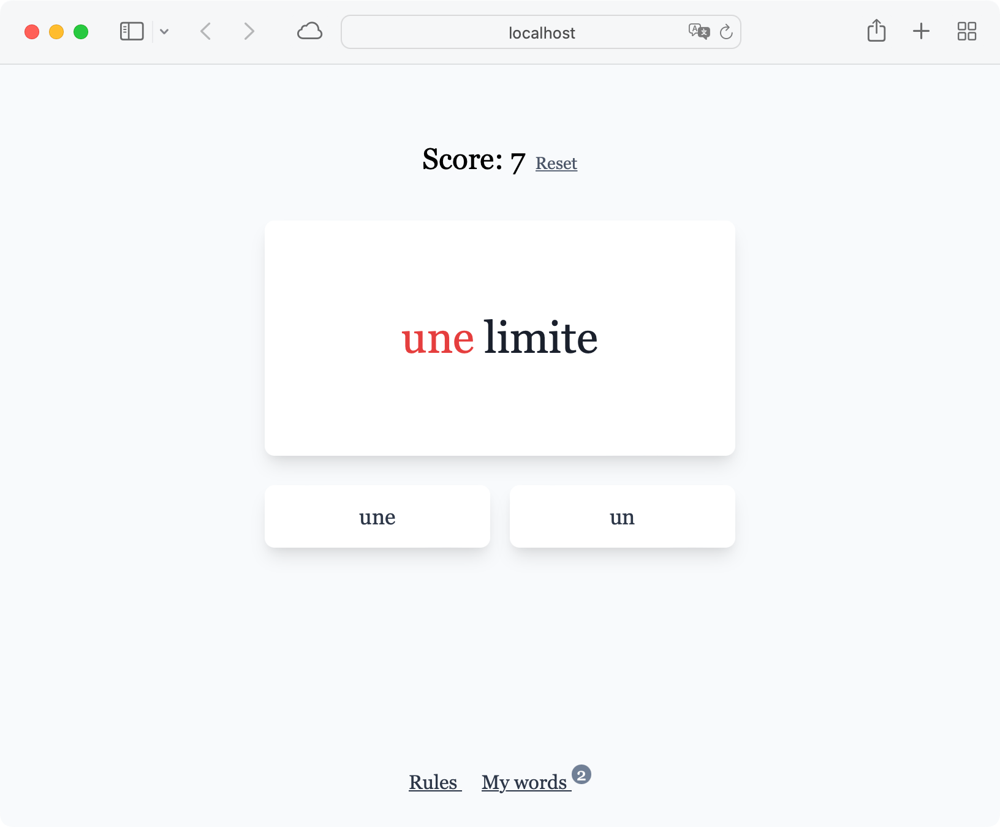

# Genders

This project is a game written in Vue that helps learners memorize the genders of French words. In the game, the user is shown a French word and must choose whether the word is masculine (un) or feminine (une). If the user's response is incorrect, the word is added to a learning list for future review. This game is a fun and interactive way to expand your knowledge of French genders and expand your vocabulary.



## Project Setup

```sh
pnpm install
```

### Compile and Hot-Reload for Development

```sh
pnpm run dev
```

### Compile and Minify for Production

```sh
pnpm run build
```
